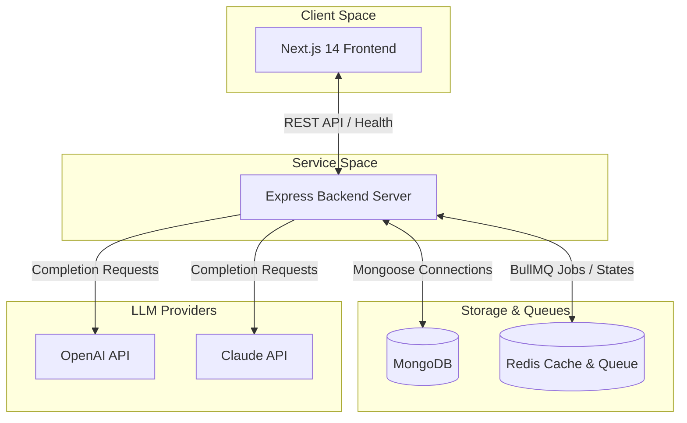
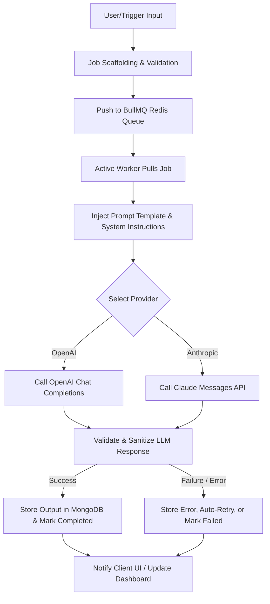

# AgentForge - AI Agent Automation Dashboard

AgentForge is a full-stack, enterprise-ready orchestration and automation dashboard for autonomous AI agents. Powered by OpenAI and Claude LLMs, it integrates a robust Express API backend, MongoDB for data storage, and BullMQ + Redis for scalable, queue-driven asynchronous task execution.

## Monorepo Project Structure

This project is organized as a workspace monorepo:
* **`/frontend`**: Next.js 14 Web UI built with React, TypeScript, and Tailwind CSS.
* **`/backend`**: Express server built with TypeScript, MongoDB (via Mongoose), and Redis (via ioredis).
* **`/shared`**: Common TypeScript schemas and interfaces shared between the frontend and backend.

---

## System Architecture



---

## Planned Agent Workflow Pipeline



---

## Setup & Installation

### Prerequisites
Make sure you have the following installed on your machine:
* **Node.js** (v18+ recommended)
* **NPM** (v9+ recommended)
* **MongoDB** (Running on port `27017`)
* **Redis** (Running on port `6379`)

### 1. Installation
Clone the repository and run `npm install` in the root folder to download and link all workspace dependencies:
```bash
npm install
```

### 2. Compilation (Build)
Compile the common shared package, followed by the backend and frontend:
```bash
# Compile shared packages
npm run build:shared

# Compile backend
npm run build:backend

# Compile frontend
npm run build:frontend
```

### 3. Environment Configurations
Configure environmental variables for both `/backend` and `/frontend`. Copies of `.env.example` are available in both folders:

* **Backend Environment (`/backend/.env`)**:
  ```ini
  PORT=5001
  MONGODB_URI=mongodb://localhost:27017/agentforge
  REDIS_URL=redis://localhost:6379
  ```

* **Frontend Environment (`/frontend/.env`)**:
  ```ini
  NEXT_PUBLIC_API_URL=http://localhost:5001
  ```

### 4. Running the Project Locally
To start the services in development mode, run:
```bash
# Run Express backend server (on port 5001)
npm run dev:backend

# Run Next.js dashboard client (on port 3000)
npm run dev:frontend
```
Once both are running, visit [http://localhost:3000](http://localhost:3000) in your browser. The frontend will show live database and Redis health signals from the API.
