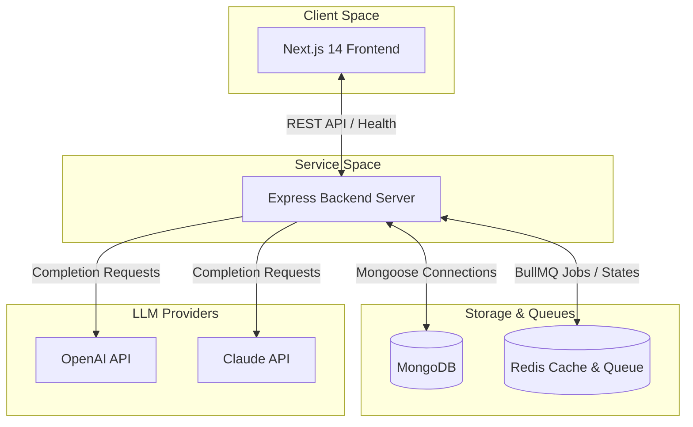
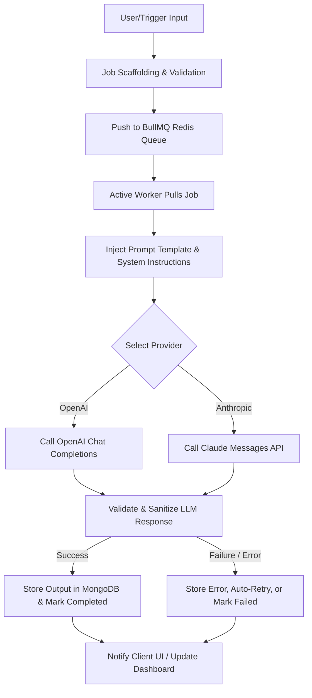
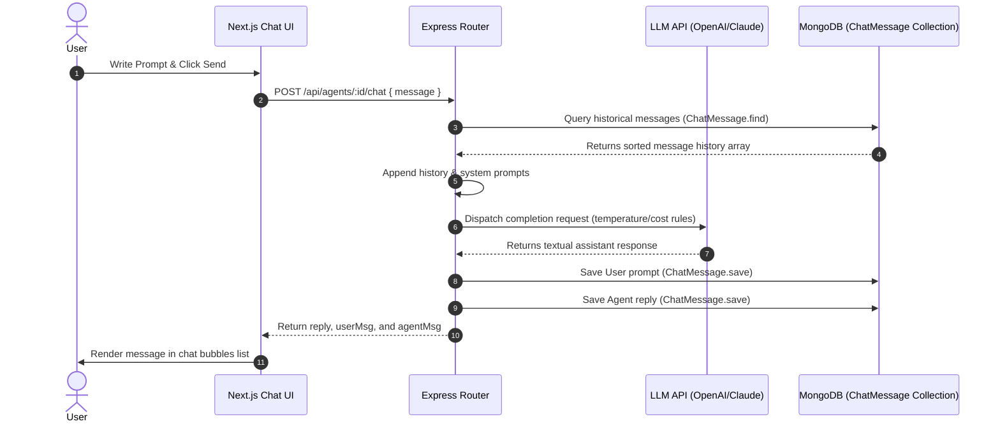
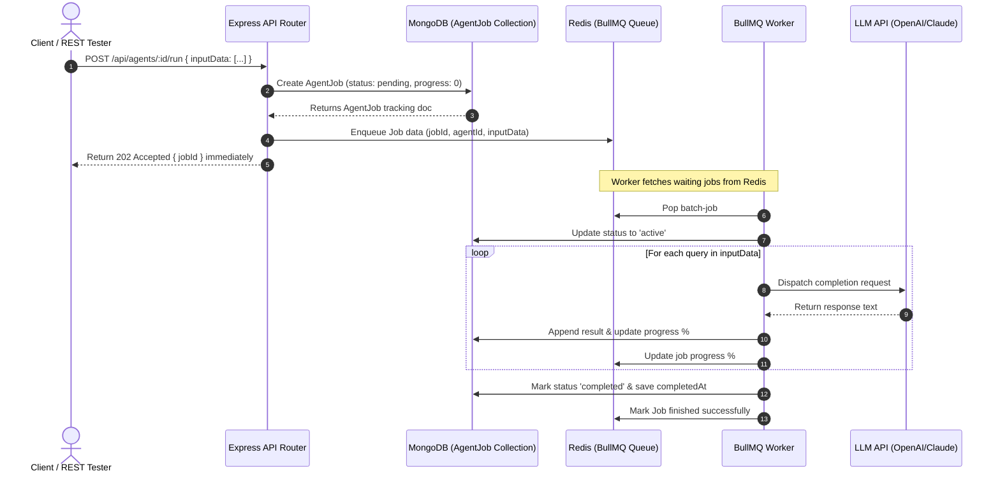
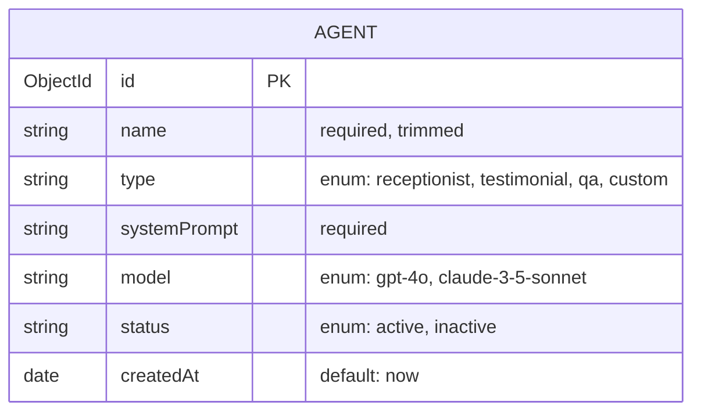

# AgentForge - AI Agent Automation Dashboard

AgentForge is a full-stack, enterprise-ready orchestration and automation dashboard for autonomous AI agents. Powered by OpenAI and Claude LLMs, it integrates a robust Express API backend, MongoDB for data storage, and BullMQ + Redis for scalable, queue-driven asynchronous task execution.

## Monorepo Project Structure

This project is organized as a workspace monorepo:
* **`/frontend`**: Next.js 14 Web UI built with React, TypeScript, and Tailwind CSS.
* **`/backend`**: Express server built with TypeScript, MongoDB (via Mongoose), and Redis (via ioredis).
* **`/shared`**: Common TypeScript schemas and interfaces shared between the frontend and backend.

---

## System Architecture



---

## Planned Agent Workflow Pipeline



---

## Chat Message Flow

The sequence below illustrates the communication flow during interactive agent chat testing:



---

## Batch Job Queue Flow

The diagram below shows the asynchronous lifecycle of batch execution runs enqueued to BullMQ:



---

## Database Schema (Agent ER Diagram)



---

## API Documentation

The backend exposes a full REST API for managing AI Agents.

| Method | Endpoint | Description | Request Body / Params | Response Status Codes |
| :--- | :--- | :--- | :--- | :--- |
| **GET** | `/api/agents` | Retrieve all agents sorted by date (descending) | None | `200 OK`, `500 Server Error` |
| **POST** | `/api/agents` | Create a new AI Agent | `{ name, type, model, systemPrompt, status? }` | `201 Created`, `400 Bad Request`, `500 Server Error` |
| **GET** | `/api/agents/:id` | Retrieve detailed configuration of a single agent | Path Param: `:id` (Mongoose ObjectId) | `200 OK`, `400 Invalid ID`, `404 Not Found`, `500 Server Error` |
| **PUT** | `/api/agents/:id` | Update configuration parameters of an agent | Path Param: `:id`, JSON body of fields to update | `200 OK`, `400 Invalid/Validation Error`, `404 Not Found`, `500 Server Error` |
| **DELETE** | `/api/agents/:id` | Delete an agent permanently | Path Param: `:id` (Mongoose ObjectId) | `200 OK`, `400 Invalid ID`, `404 Not Found`, `500 Server Error` |

---

## Setup & Installation

### Prerequisites
Make sure you have the following installed on your machine:
* **Node.js** (v18+ recommended)
* **NPM** (v9+ recommended)
* **MongoDB** (Running on port `27017`)
* **Redis** (Running on port `6379`)

### Redis Setup & Installation
The background batch processing feature uses BullMQ, which requires a running Redis instance to persist the job queue queues and state machines.

* **Docker Option (Recommended)**:
  Run Redis locally in a lightweight container:
  ```bash
  docker run --name agentforge-redis -p 6379:6379 -d redis:alpine
  ```
* **WSL / Linux Option**:
  Install and start the native service in Ubuntu/Debian:
  ```bash
  sudo apt update && sudo apt install redis-server -y
  sudo service redis-server start
  ```
* **macOS Option**:
  Start via Homebrew:
  ```bash
  brew install redis
  brew services start redis
  ```
* **Windows Native Option**:
  Download and run Redis for Windows (e.g. Memurai or archive releases) and ensure `redis-server` runs on its default port `6379`.

### 1. Installation
Clone the repository and run `npm install` in the root folder to download and link all workspace dependencies:
```bash
npm install
```

### 2. Compilation (Build)
Compile the common shared package, followed by the backend and frontend:
```bash
# Compile shared packages
npm run build:shared

# Compile backend
npm run build:backend

# Compile frontend
npm run build:frontend
```

### 3. Environment Configurations
Configure environmental variables for both `/backend` and `/frontend`. Copies of `.env.example` are available in both folders:

* **Backend Environment (`/backend/.env`)**:
  ```ini
  PORT=5001
  MONGODB_URI=mongodb://localhost:27017/agentforge
  REDIS_URL=redis://localhost:6379
  ```

* **Frontend Environment (`/frontend/.env`)**:
  ```ini
  NEXT_PUBLIC_API_URL=http://localhost:5001
  ```

### 4. Running the Project Locally
To start the services in development mode, run:
```bash
# Run Express backend server (on port 5001)
npm run dev:backend

# Run Next.js dashboard client (on port 3000)
npm run dev:frontend
```
Once both are running, visit [http://localhost:3000](http://localhost:3000) in your browser. The frontend will show live database and Redis health signals from the API.
