<p align="left">
  
</p>

AgentForge is a full-stack, enterprise-ready orchestration and automation dashboard for autonomous AI agents. Powered by OpenAI and Claude LLMs, it integrates a robust Express API backend, MongoDB for data storage, and BullMQ + Redis for scalable, queue-driven asynchronous task execution.

<table table-layout="fixed" width="100%">
  <tr>
    <td align="center" width="33%">
      <strong>Dashboard</strong><br/>
      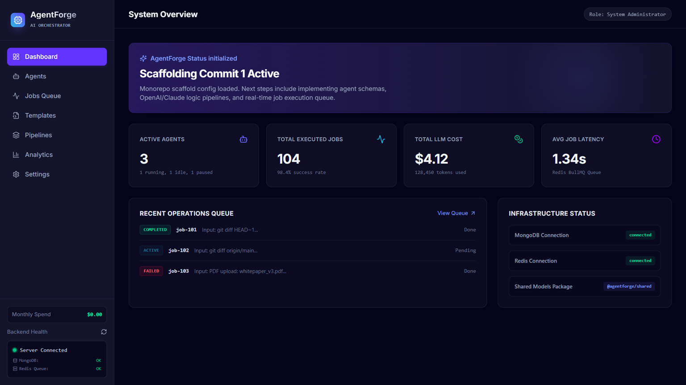
    </td>
    <td align="center" width="33%">
      <strong>Agents</strong><br/>
      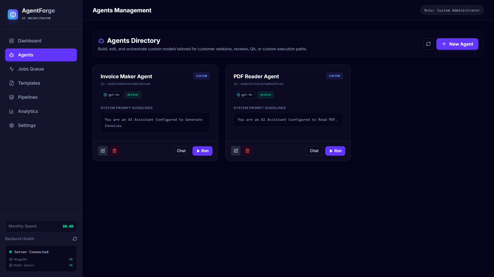
    </td>
    <td align="center" width="33%">
      <strong>Templates</strong><br/>
      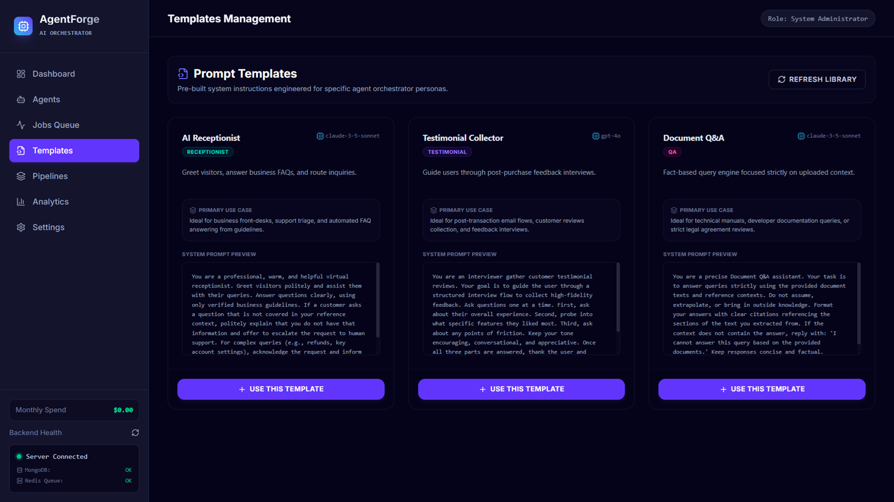
    </td>
  </tr>
  <tr>
    <td align="center" width="33%">
      <strong>Pipelines</strong><br/>
      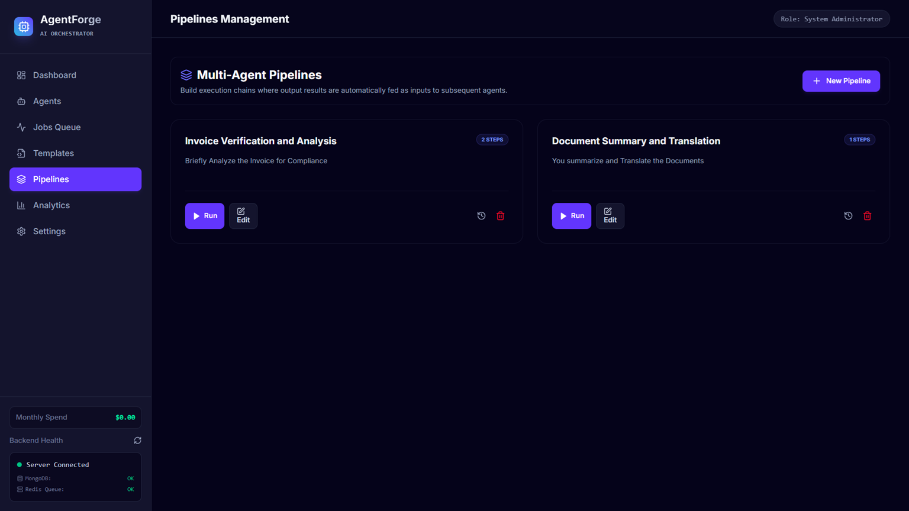
    </td>
    <td align="center" width="33%">
      <strong>Analytics</strong><br/>
      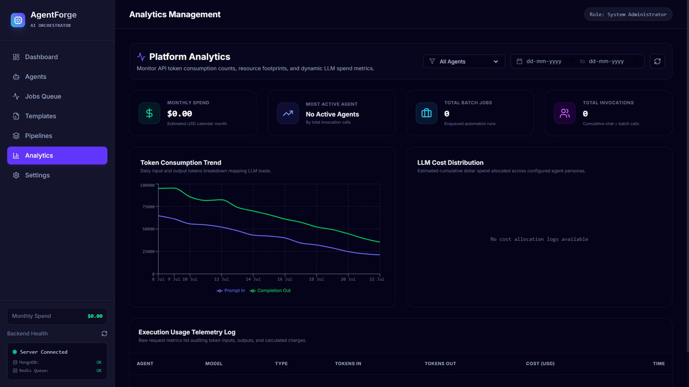
    </td>
    <td align="center" width="33%">
      <strong>Settings</strong><br/>
      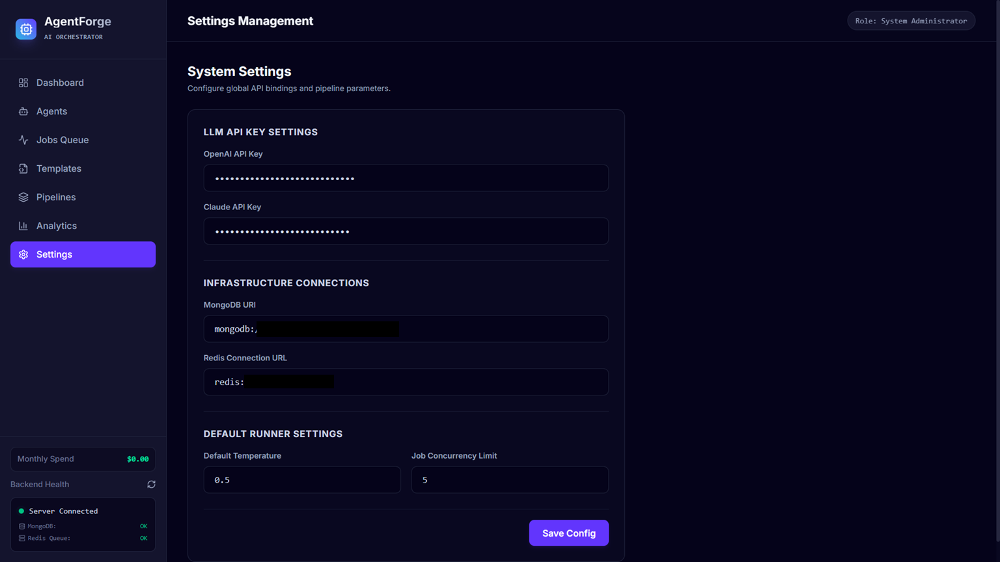
    </td>
  </tr>
</table>

> 🚀 **Live Demo**: https://www.agentforge.kpebble.com

---
## Technology Stack & Versions


---

## Monorepo Project Structure

This project is organized as a workspace monorepo:
* **`/frontend`**: Next.js 14 Web UI built with React, TypeScript, and Tailwind CSS.
* **`/backend`**: Express server built with TypeScript, MongoDB (via Mongoose), and Redis (via ioredis).
* **`/shared`**: Common TypeScript schemas and interfaces shared between the frontend and backend.

---

## System Architecture

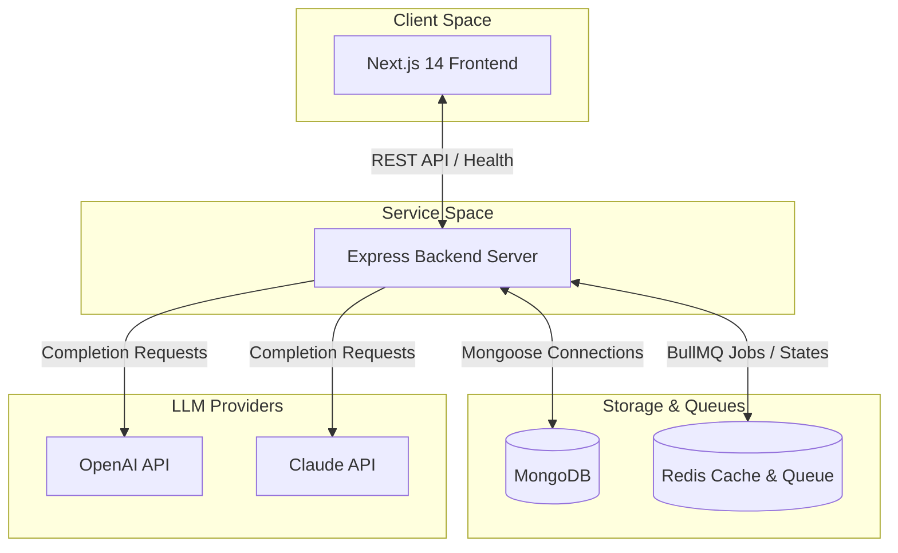

---

## Planned Agent Workflow Pipeline

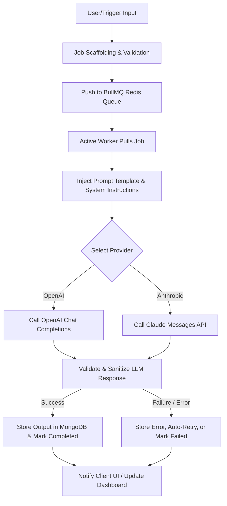

---

## Chat Message Flow

The sequence below illustrates the communication flow during interactive agent chat testing:

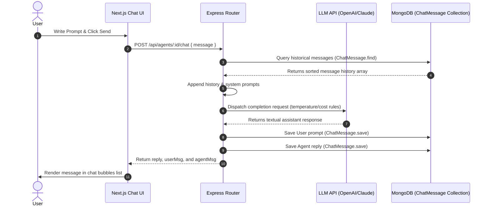

---

## Batch Job Queue Flow

The diagram below shows the asynchronous lifecycle of batch execution runs enqueued to BullMQ:

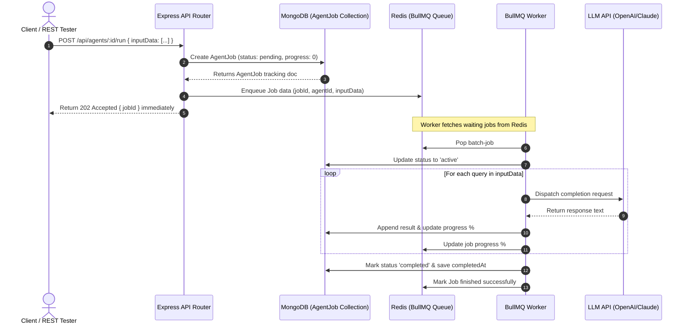

---

## Real-Time Socket.io Event Flow

The diagram below charts how background execution events stream from BullMQ workers to the frontend via Socket.io:

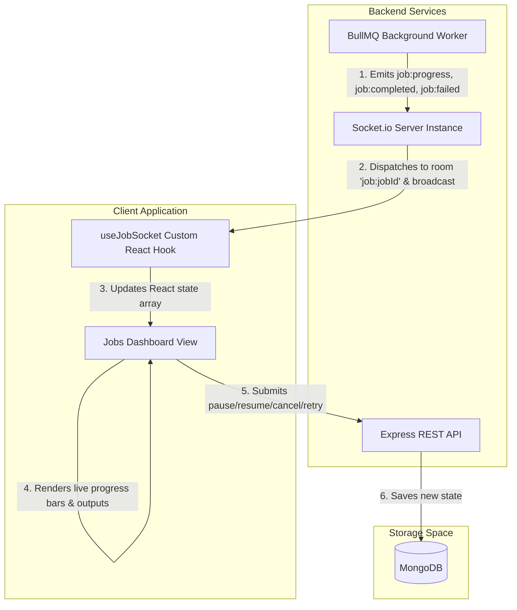

---

## Database Schema (Platform ER Diagram)

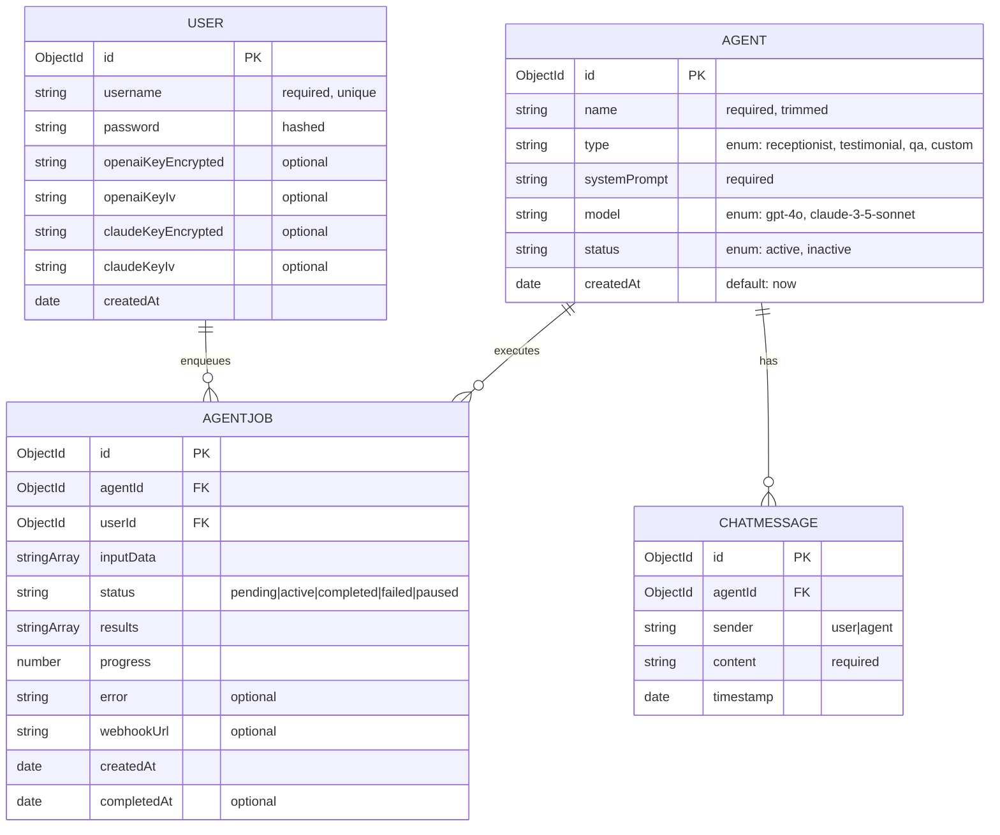

---

## Live Demo Deployments

The platform can be accessed live using the following staging URLs:
- **Web UI Dashboard (Vercel)**: [https://agentforge-dashboard.vercel.app](https://agentforge-dashboard.vercel.app)
- **REST API Gateway (Railway)**: [https://agentforge-backend.up.railway.app](https://agentforge-backend.up.railway.app)


---

## Cost Tracking Flow

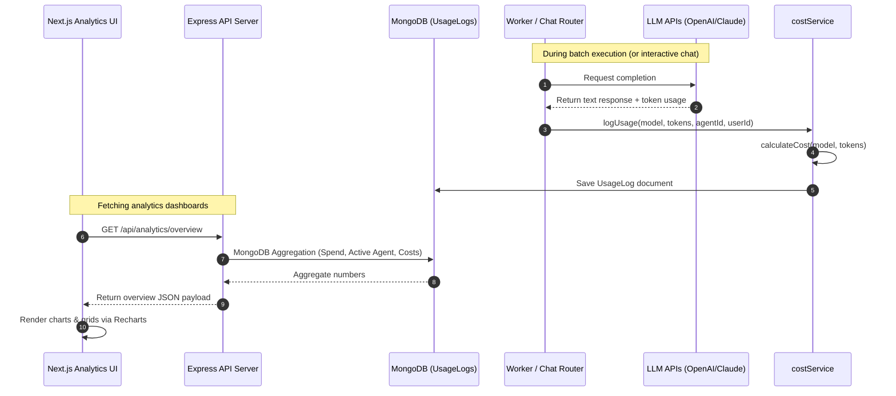

---

## Analytics & Cost Tracking

To ensure transparency and manage API costs, AgentForge includes a request-level telemetry audit logger.

### Cost Calculation Pricing Models
Rates are configured dynamically inside the [costService.ts](file:///d:/projects/AgentForge/backend/src/services/costService.ts) and calculated per 1,000,000 tokens:

| Model | Input Tokens Rate (per 1M) | Output Tokens Rate (per 1M) |
| :--- | :--- | :--- |
| **gpt-4o** | $5.00 | $15.00 |
| **claude-3-5-sonnet** | $3.00 | $15.00 |

### Cost Calculation Formula
$$\text{Estimated Cost (USD)} = \frac{\text{Input Tokens} \times \text{Input Rate}}{1,000,000} + \frac{\text{Output Tokens} \times \text{Output Rate}}{1,000,000}$$

---

## API Documentation

The backend exposes a full REST API for managing AI Agents, batch queues, and usage analytics. All private routes require a valid JWT header (`Authorization: Bearer <token>`).

| Method | Endpoint | Description | Request Body / Params | Response Status Codes |
| :--- | :--- | :--- | :--- | :--- |
| **GET** | `/api/agents` | Retrieve all agents sorted by date (descending) | None | `200 OK`, `500 Server Error` |
| **POST** | `/api/agents` | Create a new AI Agent | `{ name, type, model, systemPrompt, status? }` | `201 Created`, `400 Bad Request`, `500 Server Error` |
| **GET** | `/api/agents/:id` | Retrieve detailed configuration of a single agent | Path Param: `:id` (Mongoose ObjectId) | `200 OK`, `400 Invalid ID`, `404 Not Found`, `500 Server Error` |
| **PUT** | `/api/agents/:id` | Update configuration parameters of an agent | Path Param: `:id`, JSON body of fields to update | `200 OK`, `400 Invalid/Validation Error`, `404 Not Found`, `500 Server Error` |
| **DELETE** | `/api/agents/:id` | Delete an agent permanently | Path Param: `:id` (Mongoose ObjectId) | `200 OK`, `400 Invalid ID`, `404 Not Found`, `500 Server Error` |
| **GET** | `/api/analytics/overview` | Fetch aggregate counts, monthly spend totals, and active agent details | None | `200 OK`, `401 Unauthorized`, `500 Server Error` |
| **GET** | `/api/analytics/agents/:id` | Fetch per-agent 30-day token and cost distribution graphs | Path Param: `:id` | `200 OK`, `401 Unauthorized`, `404 Not Found`, `500 Server Error` |
| **GET** | `/api/analytics/usage` | Fetch paginated raw telemetry logs with search filters | Query parameters: `page, limit, agentId, model, startDate, endDate` | `200 OK`, `401 Unauthorized`, `500 Server Error` |

---

## Setup & Installation

### Prerequisites
Make sure you have the following installed on your machine:
* **Node.js** (v18+ recommended)
* **NPM** (v9+ recommended)
* **MongoDB** (Running on port `27017`)
* **Redis** (Running on port `6379`)

### Redis Setup & Installation
The background batch processing feature uses BullMQ, which requires a running Redis instance to persist the job queue queues and state machines.

* **Docker Option (Recommended)**:
  Run Redis locally in a lightweight container:
  ```bash
  docker run --name agentforge-redis -p 6379:6379 -d redis:alpine
  ```
* **WSL / Linux Option**:
  Install and start the native service in Ubuntu/Debian:
  ```bash
  sudo apt update && sudo apt install redis-server -y
  sudo service redis-server start
  ```
* **macOS Option**:
  Start via Homebrew:
  ```bash
  brew install redis
  brew services start redis
  ```
* **Windows Native Option**:
  Download and run Redis for Windows (e.g. Memurai or archive releases) and ensure `redis-server` runs on its default port `6379`.

---

## Security & API Key Protection

AgentForge implements industry-standard security practices to protect client secrets and preserve API availability:

1. **Authentication (JWT)**:
   All administrative, configuration, and execution endpoints require a valid JSON Web Token (JWT) provided in the `Authorization` header (`Bearer <token>`). Tokens are signed using a server-side `JWT_SECRET` and expire after 24 hours.
2. **Encryption at Rest (AES-256-CBC)**:
   To prevent token theft from database leaks, user-configured OpenAI and Claude API keys are encrypted at rest using AES-256-CBC before saving. Decryption happens dynamically in-memory during prompt execution. The cryptographic key `ENCRYPTION_KEY` is isolated in the backend environment.
3. **Throttling & Rate Limiting**:
   - **General Routes Limiter**: Enforces a budget of 100 requests per 15 minutes per IP to block DoS attempts.
   - **Job Execution Limiter**: Restricts submissions to 10 batch jobs per hour per user account to prevent API abuse and runaway costs.

---

### 1. Installation
Clone the repository and run `npm install` in the root folder to download and link all workspace dependencies:
```bash
npm install
```

### 2. Compilation (Build)
Compile the common shared package, followed by the backend and frontend:
```bash
# Compile shared packages
npm run build:shared

# Compile backend
npm run build:backend

# Compile frontend
npm run build:frontend
```

### 3. Environment Configurations
Configure environmental variables for both `/backend` and `/frontend`. Copies of `.env.example` are available in both folders:

* **Backend Environment (`/backend/.env`)**:
  ```ini
  PORT=5001
  MONGODB_URI=mongodb://localhost:27017/agentforge
  REDIS_URL=redis://localhost:6379
  JWT_SECRET=your-super-secret-jwt-key
  ENCRYPTION_KEY=f90a6e382d547f2e1a3d5b7c8e9f0c1b
  ```

* **Frontend Environment (`/frontend/.env`)**:
  ```ini
  NEXT_PUBLIC_API_URL=http://localhost:5001
  ```

### 4. Running the Project Locally
To start the services in development mode, run:
```bash
# Run Express backend server (on port 5001)
npm run dev:backend

# Run Next.js dashboard client (on port 3000)
npm run dev:frontend
```
Once both are running, visit [http://localhost:3000](http://localhost:3000) in your browser. The frontend will show live database and Redis health signals from the API.
