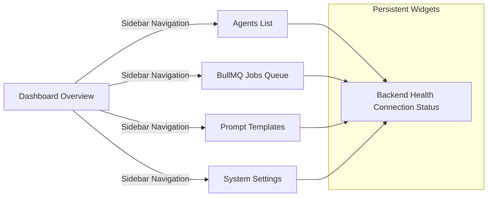

# Screentour - AgentForge Screen Maps

This document outlines the layout structure and purpose of each screen implemented as part of the initial Next.js shell.

## Screen Map

---

## Implemented Screen Details

### 1. Dashboard Overview
* **Route**: `/` (Tab: `dashboard`)
* **Purpose**: Serves as the central control room. Provides critical statistics (active worker logs, token billing summaries, average queue times) and list overviews of active operations.
* **Key Components**:
  - Global status summaries cards.
  - Active runner logs table.
  - Live connection widget check.

### 2. Agents Directory & Creator
* **Route**: `/` (Tab: `agents`)
* **Purpose**: Manages full CRUD operations for AI Agents. Users can review currently deployed personas, monitor status, and deploy new ones.
* **Key Components**:
  - **Dynamic Card Grid**: Shows agent name, type badge (colored by category), operational status toggle (Active/Inactive), and LLM engine configuration indicator.
  - **CRUD Operations Triggers**: Edit button triggers configuration edit mode, and Delete button deletes the record after confirmation.
  - **Action buttons**: Chat and Run placeholders indicating upcoming execution capabilities.
  - **Connection Disconnected Banner**: Automatically displays warning notices when the backend MongoDB port is unreachable, switching UI into mock-data fallbacks.

### Create/Edit Agent Modal
* **Purpose**: Interactive modal overlay allowing deployment or configuration modification of AI Agents.
* **Key Components**:
  - **Name Input**: Solid text input field with placeholder prompts.
  - **Orchestrator Type Dropdown**: Choice list matching `receptionist`, `testimonial`, `qa`, and `custom` categories.
  - **LLM Engine Dropdown**: Choice list matching `gpt-4o` and `claude-3-5-sonnet`.
  - **Status Selection Radio Buttons**: Active/Inactive toggle options.
  - **System Instructions Textarea**: Full-width textarea designed for multi-line instructions prompting model behaviors.

### 3. Jobs Queue Logs
* **Route**: `/` (Tab: `jobs`)
* **Purpose**: Tabulates executions managed by BullMQ queues. Focuses on system profiling, displaying processing times and token footprints.
* **Key Components**:
  - Worker state tag indicators (Active, Pending, Completed, Failed).
  - Search fields matching active tasks.
  - Processing metrics indicators.

### 4. Prompt Templates Manager
* **Route**: `/` (Tab: `templates`)
* **Purpose**: Manages instructions fed to LLM context structures. Includes variable indicators, category metadata, and text editor components.
* **Key Components**:
  - Parameter variables tags.
  - Plaintext block view components.

### 5. Settings Control Panel
* **Route**: `/` (Tab: `settings`)
* **Purpose**: Configures pipeline details, containing LLM developer key slots, Mongo and Redis ports inputs, and concurrent execution throttle settings.
* **Key Components**:
  - Masked key inputs for API integrations.
  - Mongoose URI path inputs.
  - Concurrency numeric range inputs.
