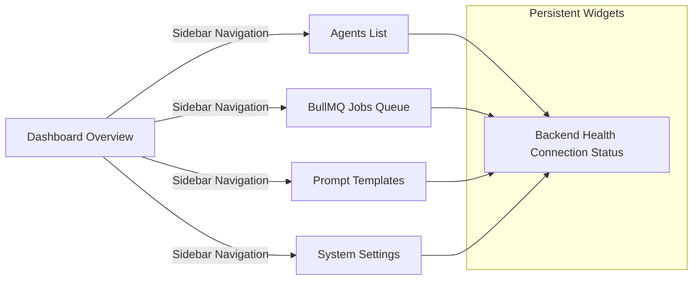

# Screentour - AgentForge Screen Maps

This document outlines the layout structure and purpose of each screen implemented as part of the initial Next.js shell.

## Screen Map

---

## Implemented Screen Details

### 1. Dashboard Overview
* **Route**: `/` (Tab: `dashboard`)
* **Purpose**: Serves as the central control room. Provides critical statistics (active worker logs, token billing summaries, average queue times) and list overviews of active operations.
* **Key Components**:
  - Global status summaries cards.
  - Active runner logs table.
  - Live connection widget check.

### 2. Agents Directory & Creator
* **Route**: `/` (Tab: `agents`)
* **Purpose**: Manages full CRUD operations for AI Agents. Users can review currently deployed personas, monitor status, and deploy new ones.
* **Key Components**:
  - **Dynamic Card Grid**: Shows agent name, type badge (colored by category), operational status toggle (Active/Inactive), and LLM engine configuration indicator.
  - **CRUD Operations Triggers**: Edit button triggers configuration edit mode, and Delete button deletes the record after confirmation.
  - **Action buttons**: Chat and Run placeholders indicating upcoming execution capabilities.
  - **Connection Disconnected Banner**: Automatically displays warning notices when the backend MongoDB port is unreachable, switching UI into mock-data fallbacks.

### Create/Edit Agent Modal
* **Purpose**: Interactive modal overlay allowing deployment or configuration modification of AI Agents.
* **Key Components**:
  - **Name Input**: Solid text input field with placeholder prompts.
  - **Orchestrator Type Dropdown**: Choice list matching `receptionist`, `testimonial`, `qa`, and `custom` categories.
  - **LLM Engine Dropdown**: Choice list matching `gpt-4o` and `claude-3-5-sonnet`.
  - **Status Selection Radio Buttons**: Active/Inactive toggle options.
  - **System Instructions Textarea**: Full-width textarea designed for multi-line instructions prompting model behaviors.

### Agent Chat Screen
* **Route**: `/` (Tab: `agents`, sub-route: chat view)
* **Purpose**: Interactive messaging workspace to test LLM completions and prompt behavior adjustments on the active agent.
* **Key Components**:
  - **Header Info**: Details the active agent name, model type, back button navigation trigger, and reload conversation history trigger.
  - **Conversation bubbles pane**: User prompts populate on the right in blue tags, and AI outputs appear on the left in slate boxes. Includes timestamp and error badge warnings.
  - **Simulated Banner warning**: Displays indicators when database settings fall back to simulation mode due to unconfigured keys.
  - **Typing dots animation indicator**: Three bouncing dots indicating waiting for LLM completions.
  - **Message prompt input**: Disabled during send cycles, coupled with send arrow button.

### 3. Jobs Queue Logs & Real-time Dashboard
* **Route**: `/` (Tab: `jobs`)
* **Purpose**: Displays the status and execution metrics of batch tasks in real-time, backed by Socket.io and Mongoose tracking logs.
* **Key Components**:
  - **Live Card List**: Displays separate control cards for each batch run. Active cards feature live-updating progress percentage and status badges.
  - **Queue Position Identifier**: Dynamic badges (e.g., `Queue Position: #1`) identifying pending task index positions inside BullMQ queues.
  - **Interactive Lifecycle Triggers**: Control keys to Pause (halts worker loops between queries), Resume (wakes up worker loops), Cancel (aborts execution and drops queue instances), or Retry (resets metrics and restarts jobs).
  - **Expandable Completion Drawer**: Expandable footer panel exposing prompt inputs alongside corresponding text outputs for completed executions.
  - **Error Logs**: Expandable red banners displaying failure details for interrupted tasks.

### 4. Prompt Templates Manager
* **Route**: `/` (Tab: `templates`)
* **Purpose**: Serves as a pre-built templates library, showcasing engineered prompt structures for fast agent deployments.
* **Key Components**:
  - **Template Catalog Cards**: Displays pre-built cards for AI Receptionist, Testimonial Collector, and Document Q&A.
  - **Configuration Badges**: Detail the type categorization and target default LLM engine (`gpt-4o` or `claude-3-5-sonnet`) for each template.
  - **Use Case Bulletins**: Summarize specific target deployment environments and project benefits.
  - **Prompt Engineering Preview**: Scrollable text blocks showing the structured system instruction details.
  - **Use Template Dispatcher**: A trigger button on each card that loads the pre-configured parameters into the Agents form builder and shifts view.

### 5. Settings Control Panel
* **Route**: `/` (Tab: `settings`)
* **Purpose**: Configures pipeline details, containing LLM developer key slots, Mongo and Redis ports inputs, and concurrent execution throttle settings.
* **Key Components**:
  - Masked key inputs for API integrations.
  - Mongoose URI path inputs.
  - Concurrency numeric range inputs.
