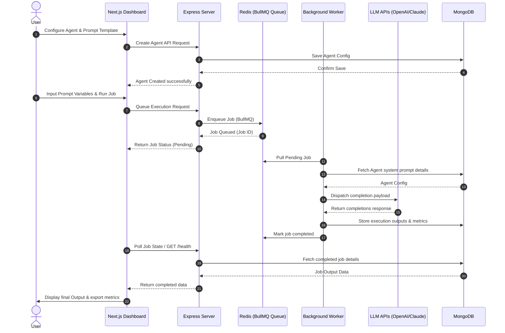

# Walkthrough - AgentForge Platform Overview

AgentForge is designed to bridge the gap between simple chat UIs and autonomous multi-agent pipelines. It enables users to create task-specific agents, configure prompt parameters, schedule jobs, and monitor execution states in real-time.

## Platform Features

### 🚧 Planned Features
* **Custom Agent Builder**: Select LLM model parameters, temperature, system prompts, and bind tools.
* **Queued Job Execution**: Push prompt variables to BullMQ workers via API.
* **Dynamic Template Manager**: Draft, parameterize, and version reusable prompts.
* **OpenAI & Claude Runner Interfaces**: Execute prompt instructions with active LLM clients.
* **Structured Output Parsing**: Parse unstructured responses into clean JSON structures.
* **Metrics Dashboard**: Watch job latency, token consumption, and success metrics live.

---

## Planned User Workflow

The flow below displays the end-to-end user experience when orchestrating agents on the platform:

