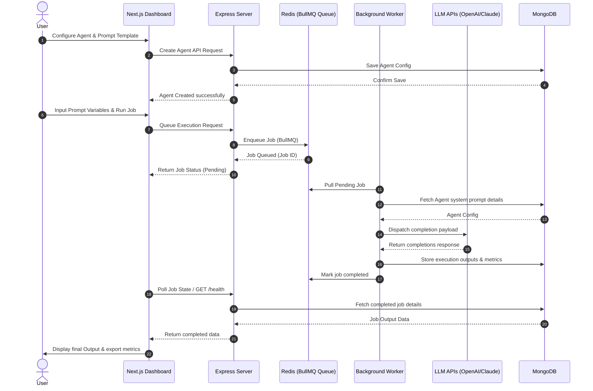

# Walkthrough - AgentForge Platform Overview

AgentForge is designed to bridge the gap between simple chat UIs and autonomous multi-agent pipelines. It enables users to create task-specific agents, configure prompt parameters, schedule jobs, and monitor execution states in real-time.

## Platform Features

### 🚧 Planned Features
* **Custom Agent Builder**: Select LLM model parameters, temperature, system prompts, and bind tools.
* **Queued Job Execution**: Push prompt variables to BullMQ workers via API.
* **Dynamic Template Manager**: Draft, parameterize, and version reusable prompts.
* **OpenAI & Claude Runner Interfaces**: Execute prompt instructions with active LLM clients.
* **Structured Output Parsing**: Parse unstructured responses into clean JSON structures.
* **Metrics Dashboard**: Watch job latency, token consumption, and success metrics live.

---

## Planned User Workflow

The flow below displays the end-to-end user experience when orchestrating agents on the platform:

---

## Core Operations Walkthrough

### Creating an Agent

Creating a new agent in AgentForge configures a persistent agent persona that can be referenced by automation tasks. Follow these steps:

1. **Access Directory**: Open the web dashboard and click on **Agents** in the sidebar. This loads the Agents grid.
2. **Launch Creator**: Click the **New Agent** button in the upper right. An overlay modal form will appear.
3. **Configure Settings**:
   - **Name**: Assign a unique name (e.g. `Doc-QA-Validator`).
   - **Orchestrator Type**: Choose the functional profile:
     - `receptionist`: Best for greeting users and extracting intent.
     - `testimonial`: Best for classifying reviews and feedback.
     - `qa`: Best for validation, integration, and UI testing.
     - `custom`: Standard freeform prompt workflows.
   - **LLM Engine**: Bind the agent either to `gpt-4o` (OpenAI) or `claude-3-5-sonnet` (Anthropic).
   - **Operational Status**: Toggle between `Active` or `Inactive` status.
   - **System Instructions**: Write the base system prompt instructions that govern the LLM behavior.
4. **Deploy**: Click **Deploy Agent**. The form sends a POST request to `/api/agents`. If successful, the modal closes and the agent card appears in the grid.

### Testing Your Agent

AgentForge includes an interactive playground to test configured agent behaviors before adding them to automation queues. Follow these steps:

1. **Access Chat**: Navigate to the **Agents** directory tab. On the target agent's card, click the **Chat** button.
2. **Review Header**: The screen transition loads the conversation workspace showing the Agent Name and LLM model badge (e.g. `gpt-4o` or `claude-3-5-sonnet`) in the header.
3. **Write Prompts**: Type your inquiry in the message input field at the bottom and click **Send** (or press Enter).
4. **Observe Response Cycle**:
   - The user message appears instantly on the right.
   - A typing indicator appears on the left as the system dispatches requests to `/api/agents/:id/chat`.
   - The server queries database history, invokes the LLM completions client, logs both prompts/responses, and returns the reply.
   - The agent message populates on the left.
5. **Simulated Sandbox Mode**: If API keys are missing, the client flags a warning notice and returns simulated replies detailing the instructions run, allowing testing without costs.
6. **Exit Workspace**: Click the **Back Arrow** button in the header to return to the Agents Directory list view.

