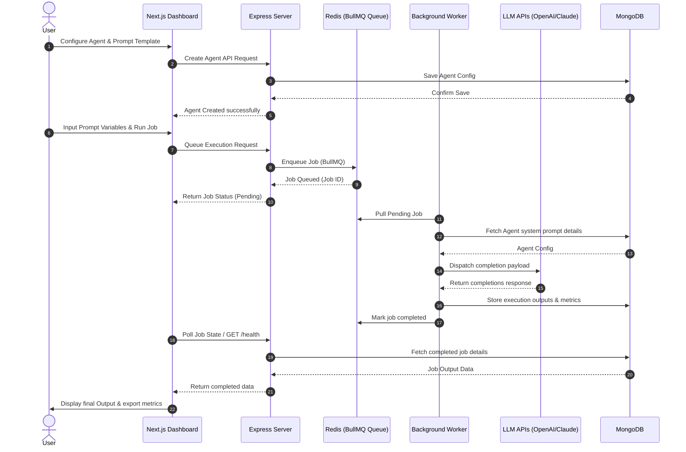

# Walkthrough - AgentForge Platform Overview

AgentForge is designed to bridge the gap between simple chat UIs and autonomous multi-agent pipelines. It enables users to create task-specific agents, configure prompt parameters, schedule jobs, and monitor execution states in real-time.

## Platform Features

### 🚧 Planned Features
* **Custom Agent Builder**: Select LLM model parameters, temperature, system prompts, and bind tools.
* **Queued Job Execution**: Push prompt variables to BullMQ workers via API.
* **Dynamic Template Manager**: Draft, parameterize, and version reusable prompts.
* **OpenAI & Claude Runner Interfaces**: Execute prompt instructions with active LLM clients.
* **Structured Output Parsing**: Parse unstructured responses into clean JSON structures.
* **Metrics Dashboard**: Watch job latency, token consumption, and success metrics live.

---

## Planned User Workflow

The flow below displays the end-to-end user experience when orchestrating agents on the platform:



---

## Core Operations Walkthrough

### Creating an Agent

Creating a new agent in AgentForge configures a persistent agent persona that can be referenced by automation tasks. Follow these steps:

1. **Access Directory**: Open the web dashboard and click on **Agents** in the sidebar. This loads the Agents grid.
2. **Launch Creator**: Click the **New Agent** button in the upper right. An overlay modal form will appear.
3. **Configure Settings**:
   - **Name**: Assign a unique name (e.g. `Doc-QA-Validator`).
   - **Orchestrator Type**: Choose the functional profile:
     - `receptionist`: Best for greeting users and extracting intent.
     - `testimonial`: Best for classifying reviews and feedback.
     - `qa`: Best for validation, integration, and UI testing.
     - `custom`: Standard freeform prompt workflows.
   - **LLM Engine**: Bind the agent either to `gpt-4o` (OpenAI) or `claude-3-5-sonnet` (Anthropic).
   - **Operational Status**: Toggle between `Active` or `Inactive` status.
   - **System Instructions**: Write the base system prompt instructions that govern the LLM behavior.
4. **Deploy**: Click **Deploy Agent**. The form sends a POST request to `/api/agents`. If successful, the modal closes and the agent card appears in the grid.

### Testing Your Agent

AgentForge includes an interactive playground to test configured agent behaviors before adding them to automation queues. Follow these steps:

1. **Access Chat**: Navigate to the **Agents** directory tab. On the target agent's card, click the **Chat** button.
2. **Review Header**: The screen transition loads the conversation workspace showing the Agent Name and LLM model badge (e.g. `gpt-4o` or `claude-3-5-sonnet`) in the header.
3. **Write Prompts**: Type your inquiry in the message input field at the bottom and click **Send** (or press Enter).
4. **Observe Response Cycle**:
   - The user message appears instantly on the right.
   - A typing indicator appears on the left as the system dispatches requests to `/api/agents/:id/chat`.
   - The server queries database history, invokes the LLM completions client, logs both prompts/responses, and returns the reply.
   - The agent message populates on the left.
5. **Simulated Sandbox Mode**: If API keys are missing, the client flags a warning notice and returns simulated replies detailing the instructions run, allowing testing without costs.
6. **Exit Workspace**: Click the **Back Arrow** button in the header to return to the Agents Directory list view.

### Running Batch Jobs

AgentForge allows you to queue multiple independent prompts for an agent to process asynchronously in the background. This queue-driven pipeline relies on BullMQ and Redis to execute batch tasks without blocking active client requests:

1. **Prepare Request Payload**:
   Construct a `POST` request payload targeting `/api/agents/:id/run`. The request body must contain an array of prompt strings:
   ```json
   {
     "inputData": [
       "Explain relativity in 20 words.",
       "What is 15 + 28?",
       "Draft a short hello email."
     ]
   }
   ```
2. **Submit Request**:
   Send the `POST` request. The API router validates the agent configuration, creates an `AgentJob` document in MongoDB with a `pending` status, adds the job to the BullMQ Redis queue, and immediately returns a `202 Accepted` status containing the tracking `jobId`:
   ```json
   {
     "message": "Batch processing job enqueued successfully",
     "jobId": "65f49e0f317b9b001efab1c2"
   }
   ```
3. **Monitor Progress**:
   Perform a `GET` request to `/api/jobs/:jobId` to check progress. The endpoint returns the full `AgentJob` document including `status`, `progress` (0 to 100), and partial `results` as they finish.
4. **Worker Lifecycle execution**:
   - The BullMQ background worker pulls the task from Redis, locking execution.
   - It updates the database status to `active`.
   - The worker runs the inputs through the agent's configured LLM (OpenAI or Claude) sequentially, incrementing the database and queue progress percentage.
   - Once all inputs are processed, the status moves to `completed`, recording a completion timestamp.
5. **Fetch Batch Results**:
   Once the progress reaches `100` and the status transitions to `completed`, retrieve the final response list from the `results` array of the `/api/jobs/:jobId` response.

### Monitoring Jobs

AgentForge provides a real-time Jobs Queue dashboard page that streams background execution events and provides complete operational lifecycle controls over batch runs:

1. **Access Dashboard**: Open the web dashboard and click on **Jobs Queue** in the sidebar. This loads the list of execution logs.
2. **Real-time Streaming**: 
   - **Active Tasks**: Render cards with a cyan-colored, live-animating progress bar. The bar and statistics update in real-time as the worker completes queries, using Socket.io subscriptions.
   - **Pending Tasks**: Render cards showing their current `Queue Position` number (e.g. `Queue Position: #2`). This tells you where the task sits relative to other pending items.
3. **Operational Controls**:
   - **Pause**: Click the **Pause** button on a running job to freeze it. The background worker halts execution between batch items and sleeps.
   - **Resume**: Click the **Play/Resume** button on a paused job to set it active. The sleeping background worker wakes up and continues.
   - **Cancel**: Click the **Cancel (X)** button on pending, active, or paused tasks to terminate them. The system pulls pending items from Redis and stops running workers, marking the status as `failed` with error `"Cancelled by user"`.
4. **Retry failed runs**: For failed or cancelled jobs, click the **Retry (Rotate arrow)** button. This resets completion stats, enqueues a fresh BullMQ task, and subscribes the client socket to the new execution room.
5. **Inspect Expandable Results**: For completed jobs, click the **View Batch Execution Results** footer to expand a details panel showing each batch input query alongside its target LLM response.

### Deploying from Templates

AgentForge provides pre-engineered prompt personas to fast-track agent creation:

1. **Access Library**: Select **Templates** in the sidebar. This lists cards for each pre-built profile (AI Receptionist, Testimonial Collector, Document Q&A).
2. **Review Engineering Choices**: Inspect details on the target card to read the use cases and prompt engineering decisions (role specifications, response constraints, formatting rules) governing prompt construction.
3. **Trigger Prefill Builder**: Click the **Use This Template** button.
4. **Deploy Agent**: The screen switches to the **Agents** tab, automatically opening the **New Agent** modal with the prefilled configurations. Verify parameters and click **Deploy Agent** to finalize creation.

### Triggering Callback Webhooks

Batch job output results can be routed automatically to external services on completion:

1. **Queue with Webhook**: When triggering a batch job via `POST /api/agents/:id/run`, supply an optional `webhookUrl` parameter in the JSON payload:
   ```json
   {
     "inputData": ["Query 1", "Query 2"],
     "webhookUrl": "https://api.yourdomain.com/callbacks/agentforge"
   }
   ```
2. **Automated Notification**: Once the BullMQ worker finishes, it makes a POST request to your URL containing job status metadata and results.
3. **Resiliency**: If your endpoint is temporarily offline, a robust retry queue handles dispatch retries with exponential backoffs (detailed in the worker logs).

### Exporting Batch Results

Batch outputs can be exported in structured formats for spreadsheet parsing or system imports:

1. **Dashboard Downloads**: On completed job cards in the **Jobs Queue** list, click on the **JSON** or **CSV** action links.
2. **API Endpoint Downloads**: Alternatively, execute a `GET` request to:
   - `/api/jobs/:id/export?format=json` (for JSON file download)
   - `/api/jobs/:id/export?format=csv` (for CSV formatted rows)

### Security and API Keys

AgentForge incorporates comprehensive authentication, encryption, and request rate-limiting guidelines to protect resources and secrets:

1. **User Authentication (JWT)**:
   - To invoke protected API endpoints, clients must first submit credentials to `/api/auth/register` and `/api/auth/login`.
   - On successful verification, the backend returns a signed JWT token.
   - Include this token in all subsequent requests within the HTTP `Authorization` header as `Bearer <token>`.
2. **Encrypted Key Management**:
   - Save or modify your personal OpenAI and Claude API keys by sending a `PUT /api/auth/keys` request with the JSON payload:
     ```json
     {
       "openaiKey": "sk-proj-...",
       "claudeKey": "sk-ant-..."
     }
     ```
   - The backend runs AES-256-CBC cipher encryption on these strings using a unique Initialization Vector (IV) and a server-side `ENCRYPTION_KEY`, writing the results to the database.
   - When executing an agent chat or queuing a batch job, the system queries the user profile, decrypts their custom key, and runs the LLM query using their keys rather than the global environment keys.
3. **Throttling & Abuse Prevention**:
   - Public and dashboard endpoints are rate-limited to 100 requests per 15 minutes per IP.
   - High-cost batch execution runs are limited to 10 jobs per hour per user account to prevent token drain and runaway expenses. If a user exceeds these counts, the endpoint responds with an HTTP `429 Too Many Requests` status.


